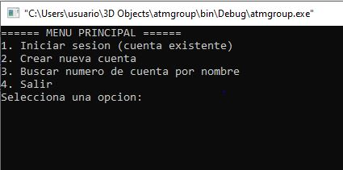
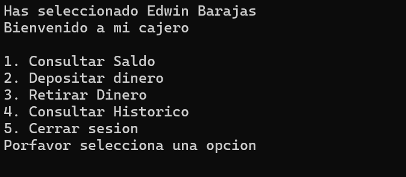

# Guia de usuario
El porgrama es muy sencillo de usar al iniciar te muestra las siguientes opciones:
1. Iniciar sesion (cuenta existente)
2. Crear nueva cuenta
3. Buscar numero de cuenta por nombre
4. Salir
   

 
La numero 1 "Iniciar sesion con cuenta existente" te abrira una ventana en la cual te pedira tus dos datos escenciales _**numero de cuenta y pin**_ te dara 3 intentos para ingresar con la cuenta que quieres acceder si fallas en las licencias te sacara de la app.
Si los datos son correctos abrira el siguiente menu:

